# DUA Streamline
## Author
Victoria Molina Martínez
## Overview
DUA Streamliner is an automated system designed to drastically simplify the preparation of the Documento Único Aduanero (DUA). It extracts, interprets, and maps information from multiple document formats into the official DUA template, generating a pre-filled Word file for expert validation.

---

## System Input

- User provides only a **folder path** (local or network).
- The folder may contain:
  - Excel (.xlsx)
  - Word (.docx)
  - PDF files
  - Scanned images (invoices or documents)
- No rigid predefined formats required.
- The system interprets heterogeneous document structures.

---

## Intelligent Processing

### a) Multi-Format Reading
- Reads Word and Excel files.
- Extracts structured and unstructured text from PDFs.
- Uses advanced OCR for scanned images.

### b) Semantic Extraction (AI-Based)
The system identifies:

- Importer/exporter data  
- Supplier information  
- Commercial and tariff description of goods  
- Quantities, weights, FOB/CIF values  
- Incoterms  
- Transport information  
- Invoice number and date  
- Country of origin and shipment  
- Applicable customs regime  

Extraction is contextual, not just keyword matching, allowing interpretation across different document structures.

---

## Mapping to Official DUA Template

- Automatically maps extracted data to official DUA fields.
- Performs basic validation:
  - Value totals
  - Currency consistency
  - Date consistency
- Flags ambiguous or low-confidence fields.

---

## Output Generation

- Generates a pre-filled Word (.docx) DUA document.
- Uses visual confidence coding:
  - Green → High confidence
  - Yellow → Medium confidence
  - Red → Requires review

---

## Core Objective

- Does not replace the customs expert.
- Transforms the expert into a strategic validator.
- Reduces repetitive manual work and minimizes errors.

---

## 1. Frontend Design
### 1.1 Technology Stack

- Application type: Web app
- Web framework: ReactJs v19.2
- Web server: Vite Dev Server v5
- Language: TypeScript v5.9.3
- Routing: React Router v6.x
- Data validation: Zod v4.3.6
  
- Unit testing: 
  - Jest v30.2.0
- Integration testing: 
  - Playwright v1.58.2
  
- Build tool: Vite v5
- Code automation task tool: Husky v9.1.7
-  Listing & Formating: 
   - Prettier version v3.8.1
   - EsLint version v10.0.2

- Cloud and Deployment:
  - Cloud: Azure Cloud Services 
  - Hosting: Azure App Service (PaaS)
  
- Code repositories: Azure DevOps Repos
- CI/CD: Azure DevOps Pipelines

- Environments:
  - Development
  - Stage
  - Production
- Environment deployment tools:
  - Azure DevOps Environments
  - Azure App Service Deployment Slots

- Observability framework:
  - Azure Monitor
  - Azure Application Insights
### 1.2 UX UI Analysis
### Usability attributes

- Usability: The system must be easy to learn and require minimal training for customs experts.

- Accessibility: The interface should follow accessibility standards such as WCAG to ensure usability for different users.

- Consistency: Navigation and interaction patterns remain uniform across all screens.

- Efficiency: The number of steps required to process documents and generate the DUA should be minimized.

- Clear feedback: The system must clearly inform the user about processing status, errors, and completion.

- Error tolerance: Users must be able to correct extracted information before generating the final document.

- Perceived performance: The system should provide real-time status updates during document processing.

- Trust and credibility: The interface should clearly show confidence levels for extracted data to support expert validation.
#### Core business 

1. The user accesses the application and authenticates into the system.

2. The user provides the location containing the commercial documentation required for the customs declaration.

3. The system scans the provided location and identifies supported document types such as spreadsheets, text documents, PDFs, and scanned images.

4. The system reads the documents and extracts textual information using document parsing and optical character recognition when necessary.

5. The extracted information is analyzed using semantic interpretation models that identify relevant customs data such as importer information, supplier details, product descriptions, quantities, invoice data, transportation details, and country of origin.

6. The system maps the identified information into the corresponding fields defined by the official DUA template.

7. The system validates the consistency of the extracted information, checking elements such as value totals, currencies, and date coherence.

8. Fields with uncertain or ambiguous data are flagged for later verification.

9.  The processed information is prepared for user review and document generation.
#### Login
1. The user provides authentication credentials to access the application.

2. The system validates the credentials against the authentication service.

3. If the credentials are valid, the system grants access to the application and initializes the user session.

4. If the credentials are invalid, access is denied and the user is requested to attempt authentication again.
- Wireframe proposed: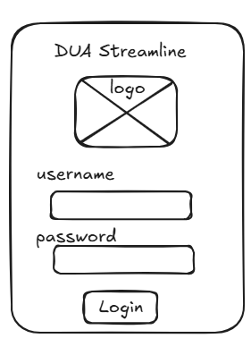
#### Process Monitoring
1. After submitting the documentation for processing, the user observes the status of the analysis process.

2. The system reads each document and extracts relevant information.

3. The system updates the processing status as each document is analyzed.

4. If a document cannot be processed, the system records the issue and continues processing the remaining documents.

5. Once all documents have been analyzed, the system prepares the extracted data for validation.
- Wireframe proposed: 
#### Result retrival
1. The user reviews the extracted data that has been mapped to the DUA structure.

2. The user verifies the detected information and corrects any fields that require manual validation.

3. Once the data is confirmed, the user requests the generation of the final DUA document.

4. The system generates a structured document based on the official DUA template.

5. The final document is made available to the user for download and further submission to customs authorities.
- Wireframe proposed: 
#### Logout
1. The user decides to terminate the session.

2. The system invalidates the active session and removes authentication credentials.

3. The user is redirected to the authentication page.
- Wireframe proposed: 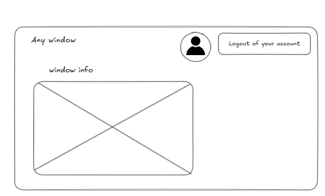

### User profiles

- Customs expert: Validates extracted information and confirms the final DUA document.

- Administrative operator: Provides the documentation folder and initiates the processing.

- Technical administrator: Maintains system availability and monitors processing performance.

---
### Usability testing with Figma prototype
## UX Validation & Testing Tools
- Prototyping: Figma
 
- Usability Testing: Maze

  - Test type: Website / Prototype testing

- Heatmap & Interaction Analysis:Graphy

    - Maze CSV exports are processed to generate

- Validation: Zod

## Testing
To validate the proposed user experience, an interactive prototype of the application was created using Figma Make. The prototype simulated the main application flows, allowing early evaluation of navigation, task execution, and user understanding before implementing the frontend.

The prototype includes the following screens:

- Login 
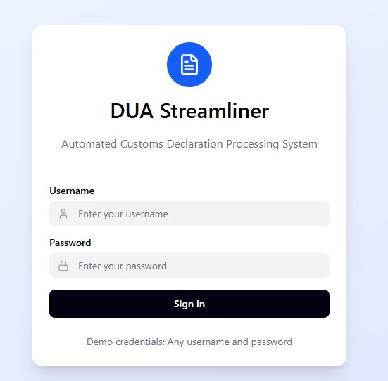

- Document processing monitoring
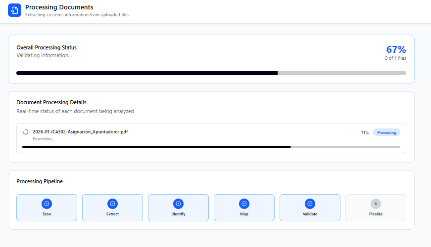

- Result validation and retrieval
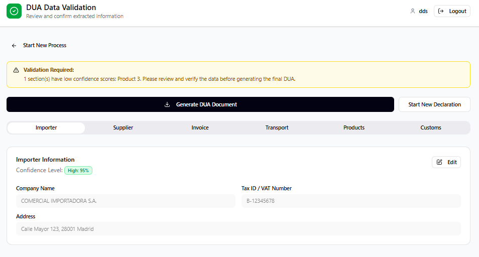

- Logout  


The prototype was shared with participants through a Figma link, allowing them to interact with the interface and simulate the main workflow of the system.

Prototype reference:
https://final-piano-64641647.figma.site/

### Manual Testing Participants
| Participant | Profile | Experience with Document Processing | Notes |
|-------------|--------|--------------------------------------|------|
| Gilda Castro | Computer engineer | High | Regularly works with commercial documentation |
| Aura Martínez | Business administrator| Medium | Familiar with customs declaration processes |
| Leopoldo Martínez | Electrical engineer and farmer | Low | Experience handling commercial documentation |
| Gastón Molina | General web user | Medium | Familiar with web applications but not with customs workflows |

---

## Results
| Task | Success Rate | Average Time | Observations |
|-----|--------------|--------------|--------------|
| Login to the system | 100% | 2 minutes | All users understood the authentication process without issues |
| Provide documentation folder | 20% | 45 seconds | User took sometime to locate the documents needed for the test |
| Monitor document processing | 100% | 10 seconds | Some users expected more visual feedback during processing |
| Validate extracted data | 75% | 5 minutes | Some users hesitated when reviewing fields flagged with medium confidence |
| Generate DUA document | 100% | 20 seconds | Users clearly understood the final generation step |
| Logout from the system | 80% | 15 seconds | No usability issues detected, but the least experienced took a little longer to logout the system|

---
## Automatic Testing
Figma prototype: https://final-piano-64641647.figma.site/ 

Testing by Maze: https://app.maze.co/report/UX-Testing-DUAStreamline/19rtmy7mmoastms/233bcdd5

Number of participants 6.

### Testing Participants profiles
| Participant | Profile | Experience with Document Processing | Notes |
|-------------|--------|--------------------------------------|------|
| Gilda Castro | Computer engineer | High | Regularly works with commercial documentation |
| Aura Martínez | Business administrator| Medium | Familiar with customs declaration processes |
| Leopoldo Martínez | Electrical engineer and farmer | Low | Experience handling commercial documentation |
| Gastón Molina | General web user | Medium | Familiar with web applications but not with customs workflows |
| Jose Gabriel | Computer engineer student | High | Familiar with web applications but not with customs workflows |
| Ruth | Electrical engineer student | Medium | Familiar with web applications but not with customs workflows |

---
## Heatmaps
Information regarded from Maze, where the data was exported by CSV, and uploaded to Graphy App to create the heatmaps.

## Login
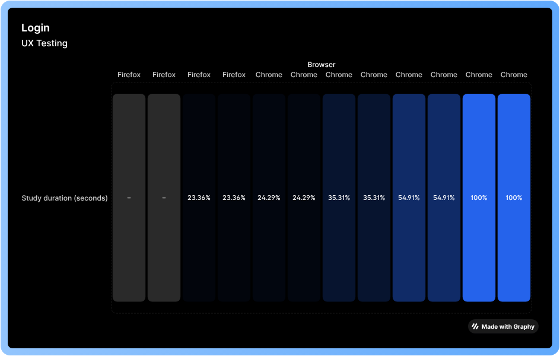

## Upload a document
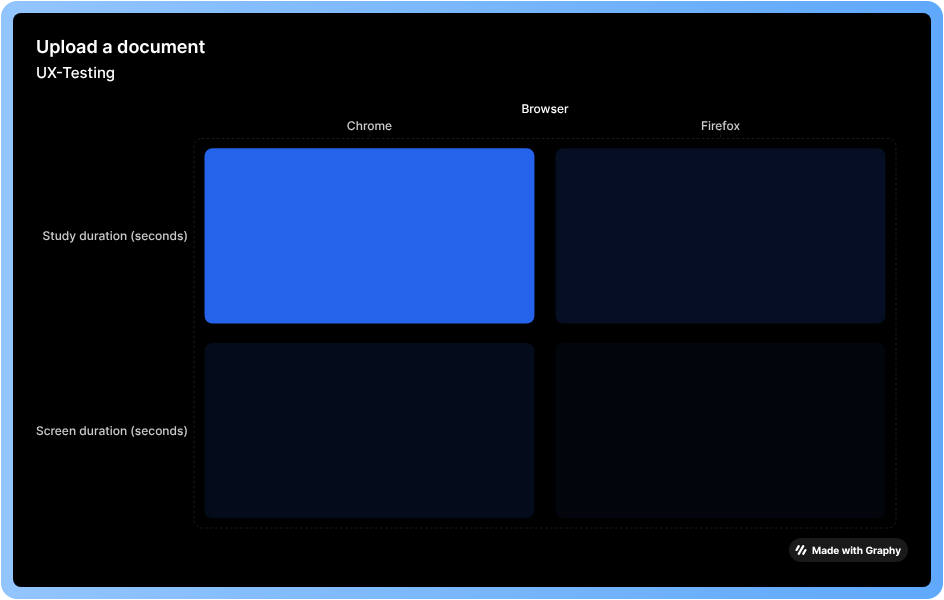

## Review extracted data
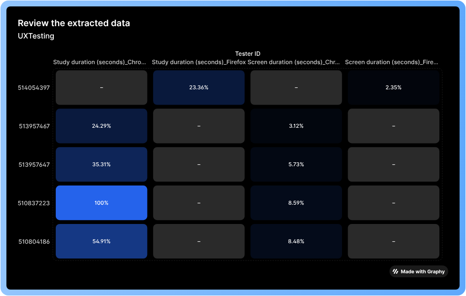

## Generate the DUA
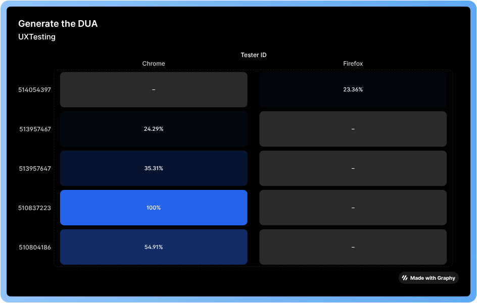

## Logout
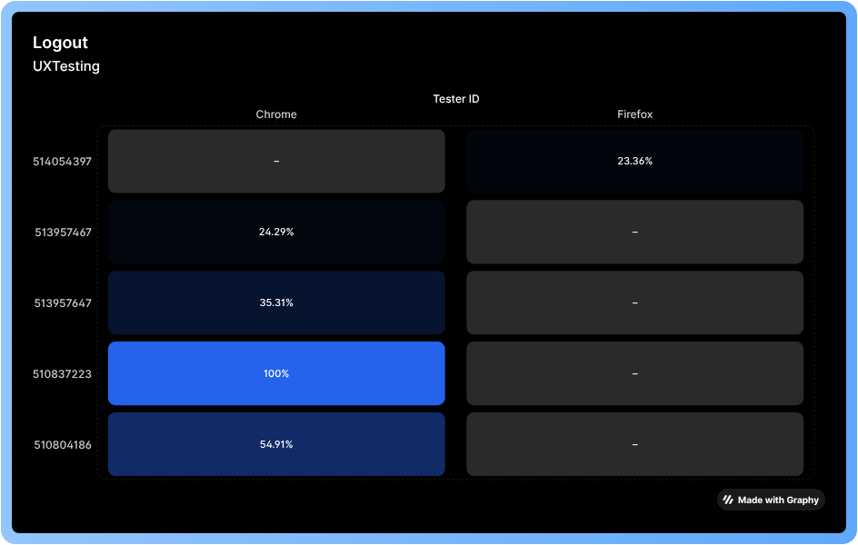

---
### Security

**Authenticator server name**: Dua_Streamline_VMM

---
**Authentication provider**: Microsoft Entra ID

---
**Authentication model**: Single Sign-On (SSO)

---
**Hosting security**: Azure App Service Authentication (Easy Auth)

---
**Transport security**: HTTPS with TLS 1.2

---
**Secret management**: Azure Key Vault

---
**Identity management**: Azure Managed Identity

---
**Session and caching support**: Azure Cache for Redis

---
**Federated identity providers** :
- Google
- Facebook

Multi-Factor Authentication (MFA): Microsoft Entra ID 

---
## Authorization

Model: Role Based Access Control (RBAC)

| Role | Description |
|-----|-------------|
| Admin | manage users, system configuration |
| CustomsExpert | validate DUA data |
| Operator | upload documents |

All authentication tokens are validated through the Microsoft Entra ID identity platform.

## Data Protection
Encryption at rest (Azure SQL + Storage)

---

## Layered design
### Folder Structure
Framework / Method: Component-Based Architecture  
Technology: React + TypeScript 
```
src/
│
├── assets/                # Images, icons, static resources
│
├── components/            # Reusable UI components
│   ├── Button/
│   │   ├── Button.tsx
│   │   ├── Button.types.ts
│   │   └── Button.test.tsx
│   │
│   ├── InputField/
│   ├── StatusIndicator/
│   ├── DocumentList/
│   └── ValidationField/
│
├── features/              # Feature-based modules
│   ├── auth/
│   ├── processing/
│   ├── validation/
│   └── document-generation/
│
├── pages/                 # Route-level views
│   ├── Login.tsx
│   ├── Dashboard.tsx
│   ├── Monitor.tsx
│   └── Results.tsx
│
├── hooks/                 # Custom React hooks
│   ├── useAuth.ts
│   ├── useProcessing.ts
│   └── useValidation.ts
│
├── services/              # API / external services
│   ├── api.ts
│   ├── auth.service.ts
│   └── dua.service.ts
│
├── context/               # Global state (React Context)
│   └── AuthContext.tsx
│
├── schemas/               # Zod validation schemas
│   └── dua.schema.ts
│
├── types/                 # Global TypeScript types
│   └── index.ts
│
├── styles/                # Global styles & theme
│   ├── theme.ts
│   ├── variables.css
│   └── globals.css
│
├── router/                # Route configuration
│   └── index.tsx
│
├── utils/                 # Helper functions
│   └── formatters.ts
│
├── App.tsx
├── main.tsx
└── vite-env.d.ts

```
## Architectural Approach

Feature-Based Modular Architecture combined with Layered Responsibility design, implemented using:

- React 19 (Component-Based UI)
- TypeScript 5.9 (Static typing)
- React Router v6 (Routing layer)
- Zod v4 (Validation layer)
- Microsoft Entra ID (Authentication – SSO + MFA)
- Azure App Service Easy Auth (Hosting security)
- Azure Key Vault (Secret management)
- Azure Managed Identity (Secure service authentication)
- Azure Cache for Redis (Session & caching support)
- Azure Monitor & Application Insights (Observability)
---
## Frontend Execution Workflow
```
- User accesses web application (React + Vite)
- Authentication handled via Microsoft Entra ID (SSO + MFA)
- Access token validated through Azure App Service (Easy Auth)
- RBAC applied (Admin / CustomsExpert / Operator)
- Route guard enforces role-based access
- User selects documentation folder
- Processing request sent via Service Layer (API integration)
- Backend performs AI-based semantic extraction
- Extracted data returned to frontend
- Zod schemas validate response structure
- State updated in React state management layer
- Validation view rendered with confidence indicators
- User reviews and edits flagged fields
- Final DUA generation request triggered
- Generated document returned for download
- Events and errors logged to Azure Application Insights
- Session managed via Azure Cache for Redis
```
---
## Mermaid Diagram-Execution Flow
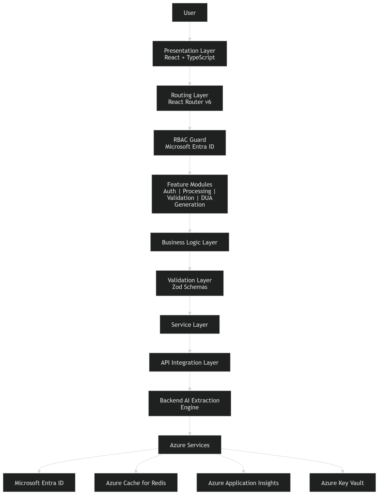
## Mermaid Diagram-Layered Architecture View


---
## Design Patterns
- **Abstraction of File Types Processing**
  - Strategy Pattern (Primary recommendation)  
  - Factory Method Pattern
---
- **Handling Long-Running Operations (AI Extraction / Parsing)**
  - Observer Pattern (Primary recommendation)  
  - Command Pattern
---
- **Single Instance Services (Auth, Config, Token Manager)**
  - Singleton Pattern  
  - ES Module Singleton Pattern (Primary recommendation for React + TypeScript)
---
- **Flexible Token Protection Strategy**
  - Strategy Pattern (Primary recommendation)  
  - Adapter Pattern
---
- **Reducing API Client Proliferation**
  - Facade Pattern (Primary recommendation)  
  - Proxy Pattern
---
- **Format-Agnostic Word Template Replacement**
  - Template Method Pattern (Primary recommendation)  
  - Visitor Pattern
---

# Backend Technology Stack 
## Backend Architectural Model

The backend follows a hybrid REST + event-driven architecture:
```
- REST API for synchronous operations
- Azure Queue for task decoupling
- Azure Functions for long-running AI processing
- SQL Database for persistence
- Redis for caching and session management
```

## Backend Execution Flow
```
- API receives processing request
- Request validated via Zod
- Job enqueued in Azure Queue
- Azure Function consumes job
- AI extraction performed
- Results persisted in Azure SQL
- Status updated in Redis cache
- Client polls status endpoint
- Document generation triggered
- Final file stored and returned
```
---
## Core Backend Stack
- **Communication Protocol**
  - HTTPS (TLS 1.2+)
---

- **API Architecture Style**
  - REST
---

- **Backend Runtime**
  - Node.js
  - TypeScript
---

- **Web Framework**
  - Fastify
---

- **Hosting Environment**
  - Azure App Service
---

- **Asynchronous Processing**
  - Azure Functions
  - Azure Queue Storage
---

- **Authentication & Authorization**
  - Microsoft Entra ID
---

- **Secret Management**
  - Azure Key Vault
---

- **Caching Layer**
  - Azure Cache for Redis
---

- **Monitoring & Observability**
  - Azure Application Insights
---
## Supporting Infrastructure & Engineering Practices
- **Database Layer**
  - Azure SQL Database

---
- **ORM / Data Access**
  - Prisma ORM

---
- **API Documentation**
  - OpenAPI (Swagger)

---
- **CI / CD Pipeline**
  - GitHub Actions

---
- **Containerization**
  - Docker

---
- **Throttling & Rate Limiting**
  - Fastify Rate Limit Plugin

---
- **CORS & Security Middleware**
  - Fastify CORS Plugin
  - Helmet

---
- **Logging**
  - Pino Logger

---
- **Validation Layer**
  - Zod

---
- **Connection Pooling**
  - Managed via Prisma + Azure SQL

---
- **API Versioning**
  - URL-based versioning (/api/v1)

---
- **Environment Configuration**
  - dotenv
---
